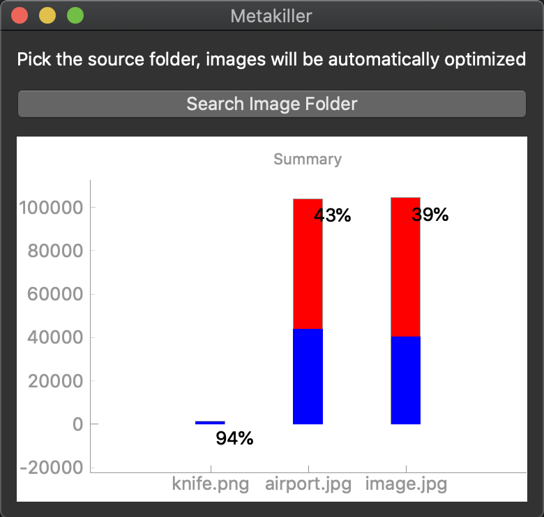

# Metakiller

This is a tool that I was looking forward to building, as it will be useful in order to make images uploaded to the web, less cluttered with metadata and pretty much well optimized for web and/or mobile applications. And by all means it was also conceived as an excuse for me to practice and learn a bit of python which has gotten so popular lately.

It basically strips images metadata and decreases images size by reducing their quality to a reasonable percentage and rolls out a bar graph where you can see how much image size decreased for each image.

## How to use it ?

Quite simple:

1. Drag and drop the source folder to the drag and drop area or click the folder picker button.
2. Find the optimized images within the "output" folder.
3. See how much decreased in size every image in a nice bar graph.

<<<<<<< HEAD
##  How to create an installer out of it ?

In order to create a shareable version of this application so that it can run in other machines you can refer to this [gist](https://gist.github.com/eiberham/039ae8334cc35d68c8961e35ced0af71) and follow the process step by step

=======
 
>>>>>>> ecd9add277e1c6bbe028cb149bbf188ee11d8d74
